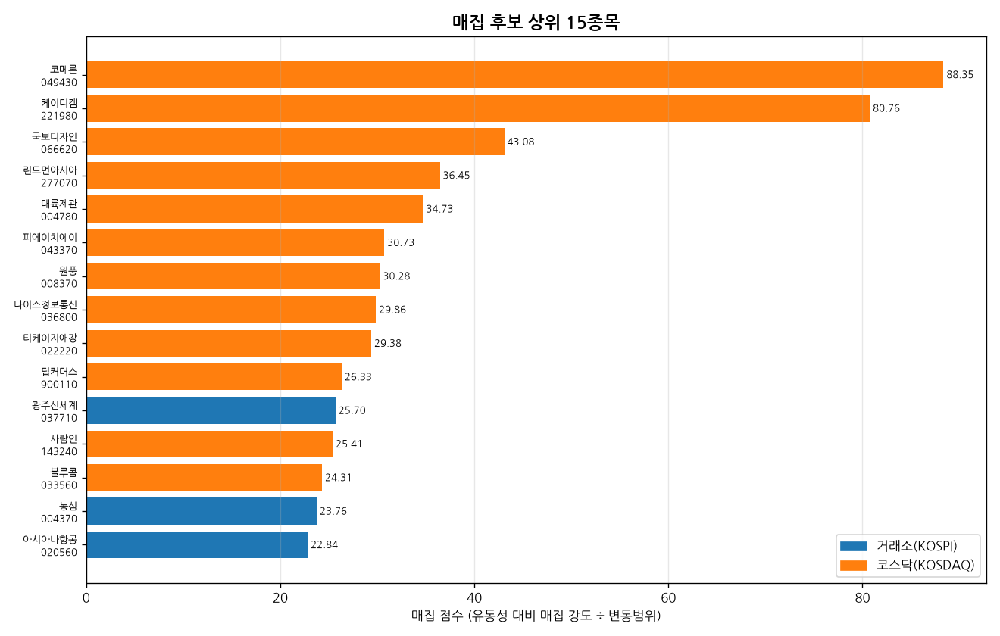
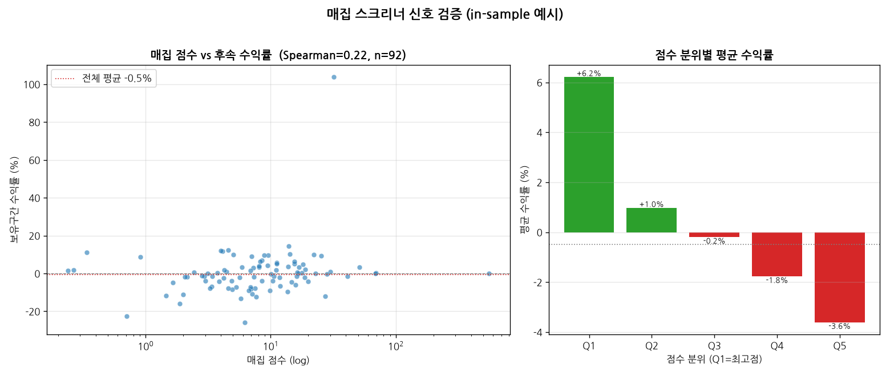
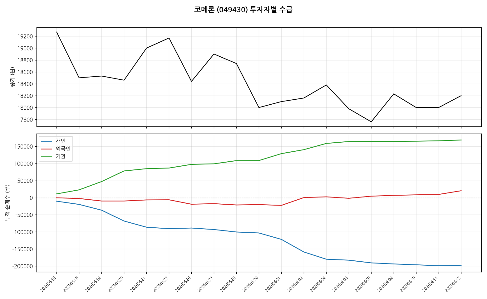

# kr-quant

코스피·코스닥 종목의 **투자자별 수급(개인·외국인·기관 순매수)** 을 수집해 SQLite에 적재하고, 이를 바탕으로 **매집(accumulation) 후보 스크리닝**과 시각화를 수행하는 퀀트 분석 툴킷입니다.

키움증권 REST API 클라이언트 [`kiwoom-client`](https://github.com/younghwan91/kiwoom-rest-api)를 기반으로 동작합니다.

---

## 결과 미리보기

**전 종목 스크리닝 → 매집 후보 랭킹**



**신호 검증 — 매집 점수가 후속 수익률과 정렬되는가**

형성구간(12거래일)에서 점수화한 후보를, 보유구간(이후 거래일)의 실제 수익률로 평가했습니다. 점수 상위 분위(Q1)일수록 평균 수익률이 높고 하위(Q5)는 음(–)으로, 점수가 단조적으로 수익률과 정렬됩니다.



**종목 수급 차트 — 횡보 속 외국인·기관 누적 순매수**



> 위 그림은 2026-05-15~06-12 수집분(19거래일)으로 생성한 **in-sample 예시**입니다. 단일 짧은 윈도우라 롤링 아웃오브샘플·거래비용·생존편향을 통제한 정식 백테스트가 아니며, 스크리너가 신호를 담고 있음을 보이는 용도입니다. 재현은 [개발](#개발) 참고.

---

## 핵심 기능

- **전 종목 수급 수집** — 코스피·코스닥 보통주(~2,600개)의 최근 N일 투자주체별 순매수를 SQLite DB로 적재 (재실행 안전, 이어받기 지원)
- **매집 스크리너** — *주가는 횡보하는데 외국인·기관이 순매수하고 개인이 순매도*하는 와이코프식 매집 패턴을 점수화·랭킹
- **시각화** — 종목별 종가 + 누적 순매수 차트 생성 (헤드리스 환경 지원, 한글 폰트)

## 아키텍처

```
kr_quant/
├── config.py          # 자격증명 로딩 + 인증 클라이언트 생성
├── storage.py         # SQLite 스키마 / 멱등 upsert
├── collectors/        # 데이터셋별 수집기 (확장 지점)
│   └── supply_demand.py
├── strategies/        # 수집 데이터 위의 전략/스크리너
│   └── accumulation.py
└── viz/               # 시각화
    └── supply_demand_chart.py
```

설계 원칙: **모듈러 모놀리식** — 라이브러리(`kiwoom-client`)는 순수 API 클라이언트로 분리하고, 데이터 수집·전략·시각화는 이 레포의 내부 모듈로 둡니다. 새 데이터셋은 `collectors/`에, 새 전략은 `strategies/`에 모듈을 추가하면 됩니다.

## 설치

```bash
git clone https://github.com/younghwan91/kr-quant
cd kr-quant
uv venv && uv pip install -e ".[viz,dev]"
cp .env.example .env          # 발급받은 키움 앱키/시크릿 입력
```

> **개발 설정**: `kiwoom-client` 의 로그인 수정(secretkey)이 포함된 `0.1.14` 이상이 필요합니다. PyPI 배포 전이라면 로컬 클라이언트를 editable 로 설치하세요:
> `uv pip install -e ../kiwoom-rest-api`

## 사용법

```bash
# 1) 수급 수집 (모의서버, 최근 30일) — 전수 ~45분
kq-collect --market all --days 30
kq-collect --market all --days 30 --prod      # 실데이터
kq-collect --resume                            # 중단 후 이어받기
kq-collect --limit 5                           # 동작 확인

# 2) 매집 후보 스크리닝
kq-screen --top 30
kq-screen --max-range 0.10 --csv candidates.csv

# 3) 신호 검증 (형성구간 스크리닝 → 보유구간 수익률)
kq-backtest --formation-days 12

# 4) 종목 수급 차트
kq-chart --code 005930
```

## 매집 스크리너 방법론

주가가 좁은 범위에서 횡보하는 동안 스마트머니(외국인·기관)가 조용히 물량을 모으는 구간은 이후 상방 돌파에 선행하는 경우가 많습니다(Wyckoff accumulation). 본 스크리너는 다음을 만족하는 종목을 후보로 선정해 점수화합니다.

1. **횡보** — 기간 내 `(고가−저가)/평균종가 ≤ max_range` (기본 15%)
2. **스마트머니 순매수** — 외국인 누적 순매수 > 0 **그리고** 기관 누적 순매수 > 0
3. **개인 순매도** — (기본) 개인이 물량을 내주는 구도

**점수** = (외국인+기관 누적 순매수 ÷ 평균거래량) ÷ 변동범위 — 유동성 대비 매집 강도를 측정하고, 횡보가 좁을수록 가산합니다.

> ⚠️ 매집 신호는 돌파를 보장하지 않습니다. 실전 활용 시 기관 세부주체(연기금·투신 vs 금융투자=프로그램), 거래량 추세, 펀더멘털을 함께 검토하세요. 본 툴은 1차 스크리닝 용도입니다.

## 데이터 스키마

| 테이블 | 주요 컬럼 |
|---|---|
| `stocks` | code, name, market, sector, kind |
| `supply_demand` | code, date, close, flu_rt, acc_trde_qty, individual, foreign_, institution, + 기관 세부 8종 (PK: code+date) |

## 개발

```bash
uv run pytest        # 네트워크 없이 통과 (storage/screener/backtest 로직)
uv run ruff check .

# README 커버 이미지 재생성 (DB 수집 후)
python scripts/make_figures.py   # → docs/images/{ranking,backtest,candidate}.png
```

## 라이선스

MIT
