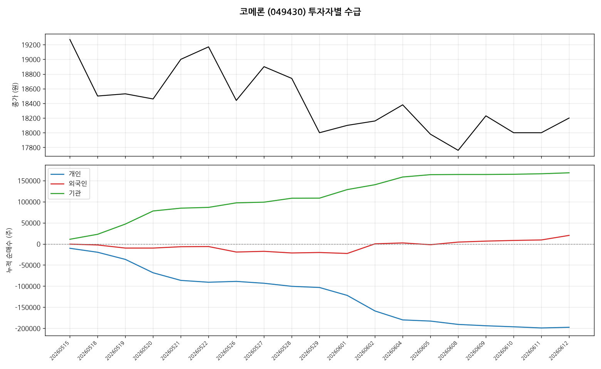

# kr-quant

[](https://www.linkedin.com/in/younghwan-chae/)

코스피·코스닥 종목의 투자자별 수급·시세·실적 데이터를 바탕으로 **PEAD, 매집(accumulation) 스크리닝, SEPA/minervini, 멀티-알파 결합** 등 전략/피처 분석을 수행하는 퀀트 리서치 라이브러리입니다. 현재까지 검증된 핵심 알파는 **PEAD**(실적 서프라이즈 드리프트)이며, 미너비니 추세추종과 결합한 멀티-알파 북이 분할조정·비용 반영 후에도 인덱스를 파레토 지배합니다 — 자세한 리서치 결론은 [research/MULTI_ALPHA.md](research/MULTI_ALPHA.md) 참고.

**데이터 수집은 이 레포에 없습니다.** 수집 로직(DART/키움/KRX/네이버 콜렉터, TimescaleDB 적재)은 [kr-quant-airflow](https://github.com/younghwan91/kr-quant-airflow)로 이전되어 그쪽에서 자체 보유합니다 — 분석 세션에서 실수로 수집기를 실행해 DB 정합성이 깨지는 사고를 막고, 수집 로직을 오픈소스로 공유하기 위함입니다. 이 레포는 TimescaleDB(또는 로컬 SQLite)를 **읽기 전용**으로 사용해 전략을 검증합니다(`kr_quant/storage.py`의 `connect()`/`market_cap_asof()` 등).

---

## 결과 미리보기

**전 종목 스크리닝 → 매집 후보 랭킹**


**신호 검증 — 매집 점수가 후속 수익률과 정렬되는가**

형성구간(12거래일)에서 점수화한 후보를, 보유구간(이후 거래일)의 실제 수익률로 평가했습니다. 점수 상위 분위(Q1)일수록 평균 수익률이 높고 하위(Q5)는 음(–)으로, 점수가 단조적으로 수익률과 정렬됩니다.


**종목 수급 차트 — 횡보 속 외국인·기관 누적 순매수**



> 위 그림은 2026-05-15~06-12 수집분(19거래일)으로 생성한 **in-sample 예시**입니다. 단일 짧은 윈도우라 롤링 아웃오브샘플·거래비용·생존편향을 통제한 정식 백테스트가 아니며, 스크리너가 신호를 담고 있음을 보이는 용도입니다. 재현은 [개발](#개발) 참고.

---

## 핵심 결과 요약 (배포형 확정: 멀티-알파 북)

서로 무상관인 세 수익원 — **PEAD**(실적 서프라이즈 롱숏), **미너비니**(추세추종 리더주), **인덱스**(시총가중 베타) — 를 결합한 북이 개별 슬리브보다 우수합니다.

| (분할조정·비용 반영, n=87~96개월) | CAGR | Sharpe | MaxDD |
|---|---|---|---|
| 시총가중 KOSPI100 프록시(벤치) | +15.5% | 0.71 | −44% |
| **멀티-알파 북 (IDX50 / PEAD25 / MNV25)** | **+19.3%** | **1.06** | **−24%** |

PEAD 단독으로는 유니버스 대비 **+8%p/년, t 2.16~2.97**(2016–2026)로 세 슬리브 중 유일하게 단독 robust. 전체 규칙·caveat은 [research/MULTI_ALPHA.md](research/MULTI_ALPHA.md) 참고.

## 핵심 기능

- **PEAD** (`kq-pead`) — DART 실적 YoY 성장 랭킹 기반 롱숏/롱온리 드리프트 전략, 이 프로젝트의 유일한 단독 robust 알파
- **매집 스크리너** (`kq-screen`) — *주가는 횡보하는데 외국인·기관이 순매수하고 개인이 순매도*하는 와이코프식 매집 패턴을 점수화·랭킹
- **SEPA / minervini** (`kq-sepa`) — 추세템플릿 + RS + VCP 피벗 돌파 리더주 전략, 무상관 분산재로서 멀티-알파 북에 기여
- **수급 신호 리서치** (`kq-supply-wave`, `kq-multi-signal`, `kq-ensemble-signal`, `kq-graph-flow`) — EWMA/랭크 기반 수급 신호, 다채널 결합, 릿지 앙상블, 그래프 확산 실험
- **시각화** — 종목별 종가 + 누적 순매수 차트 생성 (헤드리스 환경 지원, 한글 폰트)

## 아키텍처

```
kr_quant/
├── storage.py           # 읽기 전용: connect()/market_cap_asof() — 쓰기는 kr-quant-airflow/collectors/storage.py
├── price_adjust.py      # 백조정 로직 (kr-quant-airflow의 weekly_price_adjust DAG가 in-place로 실행)
├── strategies/           # 전략/스크리너
│   ├── pead.py                # PEAD — 핵심 알파
│   ├── accumulation.py        # 매집 스크리너
│   ├── backtest.py            # 매집 신호 검증
│   ├── minervini_sepa.py      # SEPA 피벗 진입, minervini_exits.py / minervini_sizing.py
│   ├── sepa_experiment.py     # SEPA 멀티암 비교 오케스트레이터, sepa_compare.py
│   ├── supply_wave.py         # 수급 신호 Phase 1
│   └── multi_signal.py        # 다채널 수급 신호 결합
├── models/               # graph_flow.py(그래프 확산), ensemble_signal.py(릿지 앙상블)
├── features/             # 피처 엔지니어링 (fundamentals, rs_rating, vcp, short_flow, sector_flow 등)
└── viz/                  # 시각화
    └── supply_demand_chart.py
```

설계 원칙: **모듈러 모놀리식** — 라이브러리(`kiwoom-client`)는 순수 API 클라이언트로 분리하고, 전략·피처·시각화는 이 레포의 내부 모듈로 둡니다. 데이터 수집(`collectors/`)은 [kr-quant-airflow](https://github.com/younghwan91/kr-quant-airflow)에 있습니다. 새 전략은 `strategies/`에 모듈을 추가하면 됩니다.

## 설치

```bash
git clone https://github.com/younghwan91/kr-quant
cd kr-quant
uv venv && uv pip install -e ".[viz,dev]"
cp .env.example .env          # KR_QUANT_DB에 TimescaleDB 접속정보 채우기 (아래 참고)
export $(grep -v '^#' .env | xargs)   # 자동 로드 안 됨 — 셸에 직접 로드
```

## 사용법

데이터 수집은 [kr-quant-airflow](https://github.com/younghwan91/kr-quant-airflow)의 Airflow DAG가 담당합니다(`python -m collectors.X`). 이 레포는 읽기 전용이며, `KR_QUANT_DB` 환경변수(비우면 로컬 SQLite)로 접속 대상을 정합니다 — 아래는 이미 채워진 DB를 대상으로 한 분석 명령입니다.

```bash
# PEAD 백테스트 (핵심 알파)
kq-pead --earnings-csv earnings.csv --horizon 60

# 매집 후보 스크리닝
kq-screen --top 30
kq-screen --max-range 0.10 --csv candidates.csv

# 신호 검증 (형성구간 스크리닝 → 보유구간 수익률)
kq-backtest --formation-days 12

# SEPA/minervini 멀티암 비교
kq-sepa

# 수급 신호 리서치
kq-supply-wave
kq-multi-signal
kq-ensemble-signal
kq-graph-flow

# 종목 수급 차트
kq-chart --code 005930
```

## 매집 스크리너 방법론

주가가 좁은 범위에서 횡보하는 동안 스마트머니(외국인·기관)가 조용히 물량을 모으는 구간은 이후 상방 돌파에 선행하는 경우가 많습니다(Wyckoff accumulation). 본 스크리너는 다음을 만족하는 종목을 후보로 선정해 점수화합니다.

1. **횡보** — 기간 내 `(고가−저가)/평균종가 ≤ max_range` (기본 15%)
2. **스마트머니 순매수** — 외국인 누적 순매수 > 0 **그리고** 기관 누적 순매수 > 0
3. **개인 순매도** — (기본) 개인이 물량을 내주는 구도

**점수** = (외국인+기관 누적 순매수 ÷ 평균거래량) ÷ 변동범위 — 유동성 대비 매집 강도를 측정하고, 횡보가 좁을수록 가산합니다.

> ⚠️ 매집 신호는 돌파를 보장하지 않습니다. 실전 활용 시 기관 세부주체(연기금·투신 vs 금융투자=프로그램), 거래량 추세, 펀더멘털을 함께 검토하세요. 본 툴은 1차 스크리닝 용도입니다.

## 데이터 스키마

| 테이블 | 용도 |
|---|---|
| `stocks` | code, name, market, sector, kind |
| `supply_demand` | 투자자별 수급 — foreign_/institution + 기관 세부 8종 (PK: code+date) |
| `daily_bars` / `daily_bars_adjusted` | OHLCV, 분할조정본은 `price_adjust.py`가 생성 |
| `earnings` | DART 실적 (avail_date 기준 룩어헤드 없음) — PEAD의 데이터 소스 |
| `consensus` | 목표주가·투자의견·forward EPS 일별 축적 |
| `shares_outstanding_history` | 시가총액 계산용 발행주식수 이력 |
| `short_selling` / `credit_balance` / `sector_index` | 공매도, 신용잔고, 업종지수 |
| `minervini_scan` / `minervini_rba` | 미너비니 스캐너 후보·회고성과 축적 |
| `delisted_stocks` | 상장폐지 종목 (생존편향 보정용) |

전체 정의는 `src/kr_quant/storage.py`의 `CREATE TABLE` 문 참고. 이 레포는 읽기 전용이며 테이블 소유·마이그레이션은 [kr-quant-airflow](https://github.com/younghwan91/kr-quant-airflow)가 담당합니다.

## 개발

```bash
uv run pytest        # 네트워크 없이 통과 (storage/screener/backtest 로직)
uv run ruff check .

# README 커버 이미지 재생성 (DB 수집 후)
python scripts/make_figures.py   # → docs/images/{ranking,backtest,candidate}.png
```

## 라이선스

MIT
