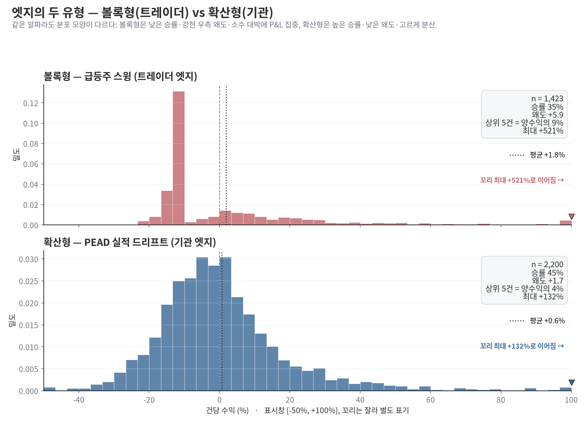
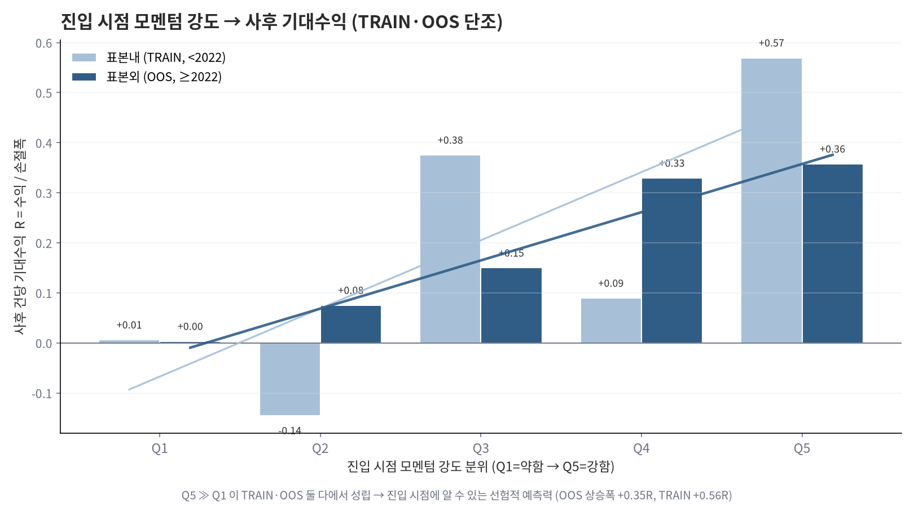
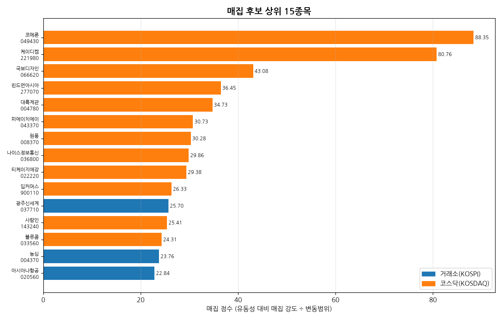
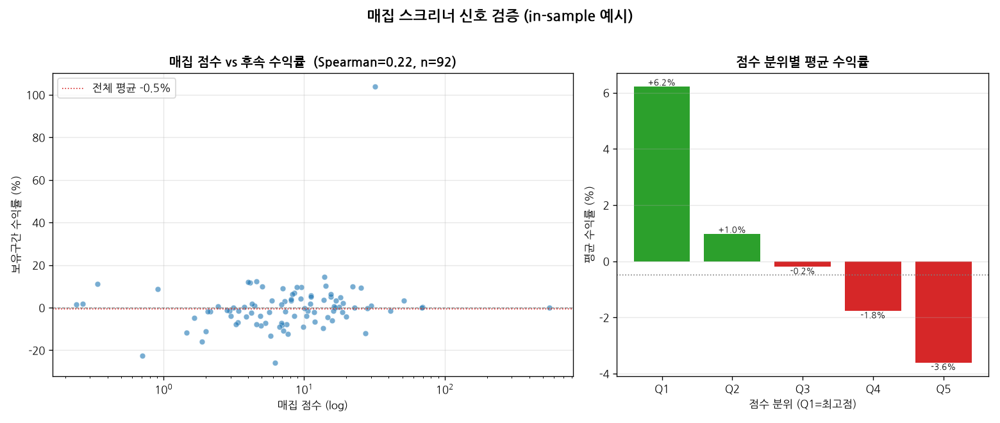

# kr-quant

[](https://github.com/younghwan91/kr-quant/actions/workflows/ci.yml)
[](LICENSE)
[](https://www.linkedin.com/in/younghwan-chae/)

**한국 주식(KOSPI·KOSDAQ) 알파를 개별 트레이드 분포 관점에서 체계적으로 분석하는 리서치 프레임워크.**

이 저장소는 세 층으로 구성된다 — (1) 재현 가능한 검증 파이프라인, (2) 그 파이프라인으로 도출한 **체계적 분석 결과**, (3) 각 전략이 왜 작동하거나 실패하는지에 대한 **메커니즘 해부**. 백테스트는 거의 언제나 우상향 곡선을 그리므로, 연구의 핵심은 "어떤 곡선이 표본 노이즈가 아니라 구조적 엣지인가"를 분포·재현성·음성대조로 판별하는 데 있다.

**한눈에 보는 발견**

- 알파에는 성격이 정반대인 두 유형이 있다 — 소수의 꼬리 사건에 의존하는 **볼록형(트레이더 엣지)**과 다수 종목에 넓게 분산된 **확산형(기관 엣지)**. 둘은 승률·왜도·집중도·재현성이 체계적으로 갈린다(§3).
- **검증된 확산형 알파는 PEAD**(실적 서프라이즈 후 드리프트)이며, 무상관 슬리브와 결합한 멀티-알파 북이 비용·분할조정 후 시총가중 인덱스를 파레토 지배한다(§4).
- **진입 시점의 모멘텀 강도가 사후의 꼬리 수익을 선험적으로(a-priori) 예측**한다는 등, 개별 트레이드 분포는 구조적 규칙성을 드러낸다(§3.2).
- 여러 볼록형 후보는 엄격한 개별-트레이드 재현성 검증을 넘지 못했다. 이는 실패의 나열이 아니라, **왜 넘지 못하는지에 대한 메커니즘 분석**으로 제시된다(§5).

> **데이터 수집은 이 저장소에 없다.** 수집 로직(DART·키움·KRX·네이버 커넥터, TimescaleDB 적재)은 [kr-quant-airflow](https://github.com/younghwan91/kr-quant-airflow)로 분리되어 있다. 본 저장소는 DB를 **읽기 전용**으로 사용한다.

---

## 1. 연구 원칙

1. **확률론적 최적화, 결정론이 아니다.** 한 번의 백테스트 경로는 분포에서 뽑은 하나의 표본이다. 그 경로의 극값(파라미터 미니마)을 추구하는 것은 곧 표본 노이즈에 과최적하는 것이다. 판정은 효과가 여러 폴드·표본에서 같은 방향으로 재현되는지로 내린다.
2. **분석 단위는 개별 트레이드다.** 평균이나 복리 자본곡선이 아니라 개별 트레이드의 R-멀티플 분포로 본다. 한 종목에서 발생한 복수의 매매는 각각 독립 표본이다.
3. **취약성은 1급 지표다.** 양(+)의 기대값이 소수의 꼬리 사건에 의존한다면 통계적 신뢰는 낮다. 상위 k건 제거 생존·최장 연패·집중도를 함께 본다.
4. **룩어헤드는 절대 금기다.** 지표는 t 시점까지의 정보로만 계산하고 진입은 t+1, 임계값은 TRAIN(진입일 < 2022-01-01)에서만 학습해 전진 적용한다.
5. **게이트는 리포터이지 판정기가 아니다.** 검증 함수는 숫자만 산출하고 배포 결정은 사람이 내린다. 하드코딩된 합격선은 그 자체가 결정론적 과최적이다.

## 2. 검증 방법론 (Definition of Done)

후보 알파는 배포 전 동일한 게이트를 통과해야 한다. 게이트는 [`research/experiments/prop_gate.py`](research/experiments/prop_gate.py)에 하나의 하버스로 구현되어 있고, 규칙과 문헌 근거는 [`docs/GUARDRAILS.md`](docs/GUARDRAILS.md)에 있다.

| 관문 | 질문 | 라이브러리 |
|---|---|---|
| Walk-forward 재현성 | 여러 시기에서 반복되는가 (clean-OOS 폴드 부호) | `kr_quant.validation.walkforward` |
| 랜덤 음성대조 | 신호를 파괴한 널(null)을 이기는가 | `prop_gate.random_entry_control` |
| 손 안 댄 최종 구간 | 탐색에 한 번도 쓰지 않은 구간에서 사는가 | `prop_gate` (untouched window) |
| 비용·슬리피지 | 현실 비용의 2배에도 사는가 | `prop_gate` (cost sweep) |
| 취약성 | 상위 몇 건을 제거해도 사는가 | `kr_quant.diagnostics.fragility` |
| 다중검정 보정 | 시도한 config 수를 반영한 Deflated Sharpe | `kr_quant.diagnostics.gate_report` |

**음성대조가 핵심인 이유.** 폴드 성공 개수만으로 판정하면 순수 노이즈도 "6폴드 중 5폴드 양수"를 약 46% 확률로 통과한다. 따라서 진짜 판별 기준은 폴드 수가 아니라 "전략이 자기 자신의 랜덤 버전을 유의하게 이기는가"이다. 정석 개념은 문헌을 따른다(§9).

## 3. 체계적 분석 — 엣지의 해부

### 3.1 두 유형의 엣지

동일한 한국 주식 데이터에서 성격이 상반된 두 종류의 엣지가 관찰된다. 이 구분은 전략을 고르기 전에 **어떤 종류의 게임을 하는지**를 규정한다.

| 축 (개별 트레이드, OOS) | 볼록형 (트레이더 엣지) | 확산형 (기관 엣지) |
|---|---|---|
| 대표 사례 | 급등주 스윙(개미 투매 역발상) | PEAD(실적 드리프트) |
| 승률 | ≈35% | ≈45% |
| 분포 왜도 | +5.9 (강한 우측 꼬리) | +1.7 |
| 최대 단일 트레이드 | +521% | +132% |
| 엣지의 출처 | 소수 대박 꼬리 | 수많은 얇은 엣지의 평균 |
| walk-forward 재현성 | 깨지기 쉬움 | 안정적 |

볼록형은 손절로 왼꼬리를 자르고 승자를 태워 오른꼬리를 노리지만, 수익이 소수 사건에 집중될수록 재현이 불안정하다. 확산형은 개별 트레이드가 얇고 승률도 압도적이지 않으나(≈45%), 상관이 낮은 다수 종목을 묶으면 분산으로 변동성이 낮아져 book 단위에서 안정적 Sharpe가 나온다(§4) — 이것이 PEAD가 트레이더 엣지가 아니라 **기관 엣지**인 이유다.


*개별 트레이드 수익 분포. 볼록형(급등주 스윙)은 왜도가 높고 소수 꼬리에 P&L이 집중되는 반면, 확산형(PEAD)은 대칭에 가깝고 넓게 분산된다.*

### 3.2 진입 시점 신호의 선험적 예측력

개별 트레이드 분포를 진입 시점 특성으로 층화하면 구조적 규칙성이 드러난다. 급등주 스윙에서 **진입 시점의 모멘텀 강도**로 5분위를 나누면, 사후 트레이드의 기대수익이 전반적으로 우상향하며 **최상위 분위(Q5)가 최하위(Q1)를 크게 상회하는 관계가 TRAIN과 OOS에서 모두 성립**한다(개별 분위는 표본 노이즈로 다소 비단조적이나 전체 방향성은 견고하다). 즉 "어느 트레이드가 대박이 될지"는 순전한 운이 아니라 진입 시점에 부분적으로 예측 가능하다. 다만 이 예측력만으로는 집중·비용을 반영한 배포 기준을 넘지 못한다 — 신호가 정보를 담는 것과 그 정보가 거래비용을 이기는 것은 별개다.


*진입 시점 모멘텀 강도로 나눈 5분위별 사후 기대수익. Q5가 Q1을 크게 상회하는 우상향 관계가 TRAIN·OOS 둘 다에서 성립한다(개별 분위는 노이즈로 다소 비단조적이다).*

분석 코드: [`research/experiments/pead_gate.py`](research/experiments/pead_gate.py), 게이트 하버스: `prop_gate`.

## 4. 검증된 알파 — 멀티-알파 북

상관이 낮은 세 수익원 — **PEAD**(실적 YoY 드리프트, 대형주 스태거드 롱온리 excess), **미너비니**(추세템플릿+VCP 돌파+breadth 레짐의 리더주), **인덱스**(시총가중 베타) — 를 고정 가중으로 결합한다. 월수익 상관은 IDX–PEAD −0.19, IDX–MNV −0.04, MNV–PEAD +0.05로 롤링 24개월에서도 |상관| < 0.25이다. 어느 슬리브도 단독으로 인덱스를 압도하지 못하지만, 무상관 결합의 분산 이득이 지속된다.

| 분할조정·비용 반영, n≈87–96개월 | CAGR | Sharpe | MaxDD |
|---|---:|---:|---:|
| 시총가중 KOSPI100 프록시 (벤치마크) | +15.5% | 0.66 | −35% |
| **멀티-알파 북 (IDX 50 / PEAD 25 / MNV 25)** | **+19.3%** | **1.06** | **−24%** |

- **PEAD는 세 슬리브 중 유일하게 단독 robust**하다 — 유니버스 대비 초과수익 약 +8%p/년, t ≈ 2.16–2.97(2016–2026), 비용후 단독 Sharpe 0.65(t 2.37). 표본을 2016–2017로 확장해도 유지된다.
- **이 수치는 생존편향 때문에 보수적이었다(2026-08-15 측정).** 상장폐지 종목을 유니버스에 넣자 같은 베이스라인의 Sharpe가 1.20 → 1.49, t가 3.47 → 4.27로 올랐다. 편향이 부풀린 것은 전략이 아니라 **벤치마크**다 — PEAD는 유니버스 대비 초과수익이라, 죽은 회사를 빼면 유니버스 평균이 실제보다 좋아 보여 초과수익이 과소 계상된다(벤치 −0.391% vs 실제 −0.606%, 기간당). 북 자체는 예상대로 −0.060%p 나빠진다. 근거·한계: [VERDICT](research/logs/survivorship_bias/VERDICT.md).
- **과최적 방지(저자 명시).** in-sample 최대-Sharpe 가중(IDX25/PEAD65/MNV10, Sharpe 1.36)은 채택하지 않는다 — PEAD 과적합이다. 고정·단순 가중이 OOS에서 견고하다. LightGBM 강화판(북 Sharpe 1.37–1.57)도 표본을 확장하면 plain PEAD와 동급으로 수렴하므로 robust한 우위로 인정하지 않는다.

전체 규칙·가중 근거·caveat: [`research/logs/MULTI_ALPHA.md`](research/logs/MULTI_ALPHA.md).

> **2026-08-13 기준 재현성 고지.** MNV 슬리브의 구현 코드(추세템플릿·VCP·SEPA 백테스트 하네스)는
> §5의 개별-트레이드 기각 판정에 따라 레포에서 삭제했다. 위 표의 수치는 삭제 시점까지 검증된
> 기록으로 남기며, 지금 레포에서 그대로 재현되지는 않는다 — 코드는 git 이력
> (`chore/remove-minervini` 이전)에 있다. PEAD·인덱스 슬리브는 영향받지 않는다.

## 5. 검증 결과 종합 — 메커니즘 분석

방법론(§2)을 여러 볼록형 스윙 가설에 적용한 결과다. 각 항목은 "죽었다"가 아니라 **왜 개별-트레이드 단위에서 재현되지 않는지의 메커니즘**으로 읽어야 한다 — 이것이 스크리너 수준의 백테스트가 놓치는 지점이다.

| 가설 | 유형 | 관측된 메커니즘 | 기록 |
|---|---|---|---|
| 개미 투매 역발상 | 볼록·급등주 스윙 | 수익이 상위 1%(순P&L의 84%)에 집중 → 단일 국면 의존, walk-forward 2/6 | [logs](research/logs/) |
| 미너비니식 돌파 | 추세추종 | 포트폴리오 성과는 레버리지·복리 효과였고, 개별 트레이드 기대값은 랜덤 널(+0.078R) 아래(−0.029R) | [VERDICT](research/logs/minervini_prop/VERDICT.md) |
| 눌림목 평균회귀 | 고승률 가설 | 가설의 전제인 고승률이 성립 안 함(34%); 널(−0.267R)보다도 낮은 −0.334R | [VERDICT](research/logs/pullback_prop/VERDICT.md) |
| 실적 서프라이즈 집중 | 이벤트 스윙 | PEAD는 느린 60일 드리프트 → 손절·보유상한이 승자를 잘라 확산 엣지를 파괴 | [VERDICT](research/logs/pead_concentrated/VERDICT.md) |

**분석적 결론.** 네 가설은 모두 오래 차익거래되어 온 가격 패턴이며, 유동 대형주에서 개별 트레이드 단위로 재현되는 롱온리 엣지를 남기지 않았다. 이 발견의 값어치는 방향 자체가 아니라 **메커니즘의 이해**에 있다 — 분산 엣지를 집중하면 왜 죽는지(PEAD 집중), 포트폴리오 지표가 왜 개별 엣지를 과대평가하는지(미너비니). 종합: [`research/logs/prop_swing_search/SUMMARY.md`](research/logs/prop_swing_search/SUMMARY.md).

## 6. 배운 점

알파가 전부가 아니다. 알파 탐색은 대부분 부정으로 끝나지만, 그 과정에서 남는 것이 더 오래간다.

- **재사용 가능한 검증 프레임워크.** walk-forward·음성대조·손 안 댄 구간·취약성·Deflated Sharpe를 하나의 게이트로 묶은 `kr_quant.validation`·`kr_quant.diagnostics`. 어떤 새 가설이든 동일한 잣대로 몇 시간 만에 심사한다 — 특정 알파보다 오래 남는 자산이다.
- **분포적 사고.** 평균이나 자본곡선이 아니라 개별 트레이드 분포로 보면 같은 데이터가 다르게 읽힌다. 볼록형/확산형 구분, 꼬리 집중도, 선험적 예측력은 이 렌즈에서만 드러난다.
- **음성대조라는 규율.** "내 전략이 랜덤보다 나은가"는 단순하지만 대부분의 자기기만을 잡아낸다(순수 노이즈가 폴드 기준을 46% 통과한다).
- **엔지니어링 토대.** PIT 데이터·무룩어헤드·읽기전용 분리·경계 린트·CI. 알파와 무관하게 재현 가능한 리서치를 떠받치는 하부구조다.
- **무엇을 하지 않을지 아는 것.** 재현되지 않는 전략을 일찍 접는 것은 실패가 아니라 자본과 시간의 절약이다.
- **메커니즘 이해.** "왜 되는가/왜 안 되는가"는 다음 탐색의 지도다 — 분산 엣지를 집중하면 죽는다, 포트폴리오 지표는 개별 엣지를 과대평가한다. 이런 통찰은 특정 전략보다 이전(transfer)된다.

검증하는 법을 갖추면 다음 알파는 더 빠르고 더 정직하게 찾는다. 이 저장소가 공유하려는 것은 결국 그 **역량**이다.

## 7. 아키텍처

```
src/kr_quant/
├── storage.py           # 읽기 전용 DB 접근 (connect / market_cap_asof)
├── price_adjust.py      # 기업행동 백조정 (airflow DAG가 in-place 실행)
├── engine/              # 백테스트 엔진: cross-sectional sim, 패널, 메트릭, recipe
├── validation/          # walk-forward·민감도·BO 목적함수·purge/embargo·생존편향 검사
├── diagnostics/         # R-멀티플 분포·취약성·gate_report(리포터)
├── strategies/          # pead · accumulation · supply_wave · multi_signal
├── models/              # graph_flow(그래프 확산) · ensemble_signal(릿지 앙상블)
├── features/            # fundamentals · short_flow · sector_flow · universe
└── viz/                 # 수급 시각화

research/                # 리서치 실험 (라이브러리를 호출하는 얇은 스크립트)
├── signals/             # 신호 정의 (contrarian_retail · operator_flow)
├── experiments/         # 실험 러너 — prop_gate 게이트 하버스로 심사
└── logs/                # VERDICT · SUMMARY (검증·분석 결과 기록)
```

설계 원칙: `src/kr_quant`는 순수 라이브러리(numpy/pandas)로 `research/`를 import하지 않는다(경계는 `scripts/check_guardrails.py`가 CI에서 강제). 새 알파의 표준 흐름은 [`research/TEMPLATE.md`](research/TEMPLATE.md).

## 8. 재현

```bash
git clone https://github.com/younghwan91/kr-quant
cd kr-quant
uv venv && uv pip install -e ".[viz,dev]"
cp .env.example .env          # KR_QUANT_DB에 TimescaleDB 접속정보 (비우면 로컬 SQLite)

uv run pytest                 # 네트워크 불요 — 검증·진단 라이브러리 회귀 테스트
uv run ruff check .
python scripts/check_guardrails.py   # 경계·리포터 규율 검사
```

분석 CLI(모두 DB 읽기 전용): `kq-pead`(PEAD 백테스트), `kq-screen`(매집 스크리너, §9), `kq-chart --code 005930`(수급 차트).

## 9. 참고 문헌

- Bailey, D. H., & López de Prado, M. (2014). *The Deflated Sharpe Ratio.* Journal of Portfolio Management.
- Bailey, D. H., Borwein, J., López de Prado, M., & Zhu, Q. J. *The Probability of Backtest Overfitting* (CSCV).
- Harvey, C. R., & Liu, Y. (2016). *…and the Cross-Section of Expected Returns.* Review of Financial Studies (다중검정 t-haircut).
- López de Prado, M. (2018). *Advances in Financial Machine Learning* (purged K-fold + embargo).

## 10. 부록 — 매집 스크리너

주가가 좁은 범위에서 횡보하는 동안 외국인·기관이 순매수하고 개인이 순매도하는 와이코프식 매집 구간을 점수화하는 1차 스크리너다. 점수 = (외국인+기관 누적 순매수 ÷ 평균거래량) ÷ 변동범위. 이는 검증된 알파가 아니라 **탐색용 스크리너**이며, 아래 그림은 단일 짧은 윈도우(2026-05-15~06-12, 19거래일)의 **in-sample 예시**로 성과 주장이 아니다.




> 매집 신호는 돌파를 보장하지 않으며, 롤링 아웃오브샘플·거래비용·생존편향을 통제한 정식 백테스트가 아니다. 재생성: `python scripts/make_figures.py`.

## 11. 데이터 스키마 (읽기 전용)

| 테이블 | 용도 |
|---|---|
| `stocks` | code, name, market, sector, kind |
| `supply_demand` | 투자자별 수급 (foreign/institution + 기관 세부 8종, PK: code+date) |
| `daily_bars` / `daily_bars_adjusted` | OHLCV; 분할조정본은 `price_adjust.py` 생성 |
| `earnings` | DART 실적 (avail_date 기준 룩어헤드 없음) — PEAD 소스. PK는 `(code, period, knowledge_date)`로, 정정공시는 기존 행을 덮어쓰지 않고 새 버전으로 쌓인다 — 읽을 때 `knowledge_date <= t`로 그 시점에 알 수 있었던 값을 고른다 |
| `consensus` | 목표주가·투자의견·forward EPS 일별 축적 |
| `shares_outstanding_history` | 시가총액용 발행주식수 이력 |
| `short_selling` / `credit_balance` / `sector_index` | 공매도·신용잔고·업종지수 |
| `delisted_stocks` | 상장폐지 종목 (생존편향 보정용) |

테이블 소유·마이그레이션은 [kr-quant-airflow](https://github.com/younghwan91/kr-quant-airflow)가 담당한다.

## 12. 범위와 한계

- **단일 시장·일봉 지평.** 결과는 한국 유동 대형·중형주와 일봉 데이터에 한정된다. 장중·틱·대체데이터는 다루지 않는다.
- **용량(capacity).** 대형주 스태거드 롱온리 기준이며, 소형·급등주 확장 시 슬리피지·용량은 별도 통제가 필요하다.
- **생존편향.** `delisted_stocks`로 부분 보정하나 진정한 delisting return의 완전성은 데이터 벤더에 의존한다(`universe_hygiene`는 스멜테스트이지 보증이 아니다).
- **과거는 미래를 보장하지 않는다.** 모든 수치는 백테스트 결과이며, 이 저장소의 기여는 수익 보장이 아니라 **체계적 검증 방법론과 그 분석 결과의 공유**다.

## 라이선스

MIT


---

## ⭐ 도움이 되셨다면

이 프로젝트가 유용했다면 우측 상단 **[⭐ Star](https://github.com/younghwan91/kr-quant)** 를 눌러주세요. 검색·추천 노출이 올라가 더 많은 분들이 찾을 수 있습니다.

- 🐛 버그·질문 → [Issues](https://github.com/younghwan91/kr-quant/issues)
- 📈 업데이트 소식 → [팔로우 @younghwan91](https://github.com/younghwan91)

## 관련 프로젝트 — 한국 주식 퀀트 스택

시세·펀더멘탈·뉴스 수집 REST API부터 데이터 파이프라인, 백테스트·알파 리서치까지 이어지는 오픈소스 스택의 일부입니다.

| 프로젝트 | 설명 |
|---|---|
| **[kiwoom-rest-api](https://github.com/younghwan91/kiwoom-rest-api)** | 키움증권 REST API Python 라이브러리 — 207개 엔드포인트 + 실시간 WebSocket |
| **[krx-fundamentals-api](https://github.com/younghwan91/krx-fundamentals-api)** | 국내 기업 펀더멘탈 REST API — 재무제표·투자지표·배당·종목 스크리닝 (DART + KRX + 네이버) |
| **[krx-news-rest-api](https://github.com/younghwan91/krx-news-rest-api)** | 한국 주식 뉴스·공시 수집 REST API (FastAPI + Redis) |
| **[kr-quant-airflow](https://github.com/younghwan91/kr-quant-airflow)** | 시세·수급·실적 데이터를 TimescaleDB로 수집하는 Airflow 파이프라인 |
| **[quantbox-engine](https://github.com/younghwan91/quantbox-engine)** | 암호화폐 선물 백테스트·실행 엔진 — 룩어헤드 0, 백테스트↔실거래 일체화 |
| **[opt_portfolio](https://github.com/younghwan91/opt_portfolio)** | VAA 기반 전술적 자산배분 백테스트·운용 시스템 |
| **[automated-stock-trading-systems](https://github.com/younghwan91/automated-stock-trading-systems)** | Bensdorp의 7개 비상관 트레이딩 시스템 백테스터 (교육용 재구현) |

## 만든 사람

**채영환 (Younghwan Chae)** · [GitHub @younghwan91](https://github.com/younghwan91) · [LinkedIn](https://www.linkedin.com/in/younghwan-chae/)

전체 오픈소스 퀀트 스택은 [프로필](https://github.com/younghwan91)에서 한눈에 볼 수 있습니다.
